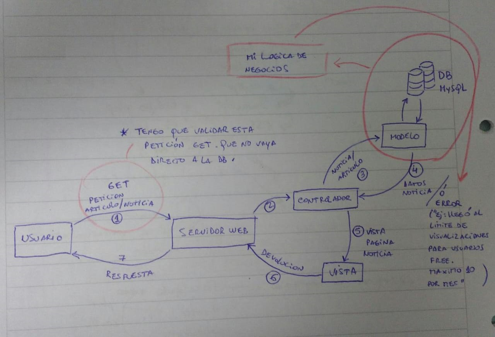
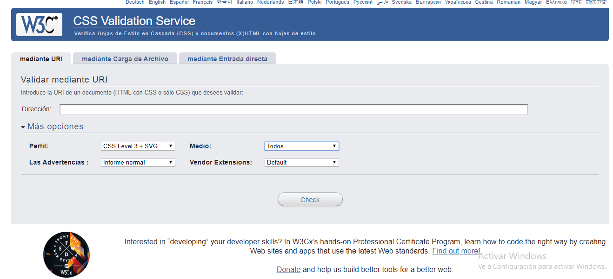

<h1>11086 - Programación en AmbienteWeb - UNLU 
Primer Parcial 2020<h1> 

<h4>Imagine una aplicación web "portal de noticias" y responda las siguientes consignas:  <h4>

<h2>1. ¿Por qué las sesiones pueden guardar mucha más información que las cookies? ¿Qué almacenaría para esta app en cookies y/o sesiones? </h2>

<h4>
Desde el punto de vista de la cantidad de informacion, las cookies manejan informacion de un usuario y un dispositivo ya que corren del lado del cliente, sin embargo las sesiones manejan infomacion estadistica, es decir, los dispositivos y lugares desde los que se accedio a una sesion.  
En este sentido, van a guardar la informacion de todas las cookies de los dispositivos en los que el usuario se loguea; por lo que la informacion manejada siempre sera mayor en la sesion. 

En el contexto de la app de noticias, en las cookies guardare los clicks referidos a las noticias, dispositivo que usa, id del usuario (el cual no sera un apuntador directo a la DB sino, un ID encriptado), 
En el lado de la sesiones: el id de session, todos los dispositivos que usa el usuario, noticias de interes, o palabras clave (tags), para saber que noticia es mas importante para el promedio de usuarios que busca este tipo de app. 

Al usuario logeado, le mostraria informacion relacionada con las noticias que vio. 
<h4>

<h2>2. ¿Qué ventajas ofrece el uso de Virtualhost en el contexto de servidores Web (en gral y en particular para esta app)? </h2>

<h4>Un virtualHost, me permitiria en esta app, dividir el servidor de noticias en diferentes secciones. Digamos que mi portal de noticias es www.clarin.com, mis virtualhost serian: 

www.deportes.clarin.com 
www.cine.clarin.com 
www.teatro.clarin.com 
www.economia.clarin.com 
www.buenavida.clarin.com 

Permite dividir a los grupos de trabajo, evitando que un redactor de una seccion en particular, tenga acceso a informacion de otra seccion que no necesariamente debe saber. 
</h4> 

<h2>3. Defina con sus palabras la diferencia principal entre contenido estático y dinámico. </h2>

<h4>El contenido dinamico, implica procesamiento del lado del servidor, entonces podremos encontrar codigo php (el cual genera client site code), templates, cgi. En cambio el contenido estatico son todos esos archivo para los cuales el servidor toma la informacion del disco y lo entrega, con lo cual, el mismo hasta puede ser cacheado para evitar tener que hacer repetidas peticiones al servidor; ejemplo de estos son las imagenes, los videos, el codigo css (de diseño), el codigo javascript, es todo aquello que es cacheado por los browser, los servidores web, los CDN (Content Delivery Network) como Cludflare, Akamai, etc.</h4>

<h2>4. ¿Cómo aplicaría el modelo MVC para el diseño de esta app?. No necesita escribir código alguno, sino argumentar conceptualmente como separaría la lógica de la app en estos tres elementos. </h2>

<h4>
En la app de noticias, las Vistas mostraran los resultados, que la Capa controladora, con funcion de dispacher, redireccione al usuario, con el resultado obtenido de la capa de Modelos la cual tendra el contenido de los articulos. 
En terminos generales, el controlador recibira las peticiones GET sobre los articulos y pedira esa informacion a la capa de modelos. 
La capa de modelo, tendra almacenada en su base de datos, los articulos y otra informacion referida al usuario. Aqui es donde tendre toda mi logica de negocios,  es decir, para brindar un ejemplo dependiendo del tipo de usuario (pago, o free) serviré la pagina o devolvere una respuesta de error al controlador, el cual verá, dependiente del tipo de error mostrar al usuario, usando la vista correspondiente.
<h4> 

<h4>
Se puede ver en el paso 4, que el modelo puede responder sirviendo la noticia o mostrando un mensaje de error, dependiendo de: el tipo de usuario (si es pago o no), si la noticia ya no exite o caduco, etc. 
Hay que tener en cuenta que hay que validar todas las peticiones, preferentemente las haria en el modelo, pero si les aplico un filtro en la capa controladora puedo ahorrar procesamiento y tiempo. 
</h4>

<h2>5. a) ¿Por qué es posible afirmar que PDO mejora la seguridad en la capa de base de datos de una app PHP? 
b) ¿Qué otras cuestiones debemos tener en cuenta en la capa de base de datos en el sentido de la seguridad? <h2>

<h4>
a) PDO es un driver mas que crea una capa de separacion entre el tipo de base de datos que se vaya a usar, por lo que, si llegase a migrar la base de datos a otro gestor (ej mysql a progresql), la capa de modelos no se veria afectada en sus metodos/ llamadas a la DB.   

b) otra cuestion a tener en cuenta, son las sql inyections, las que podemos evitar si se aplican filtros a las entradas que van a ir directamente a la base de datos, por ejemplo una consulta de los articulos de noticias, donde hay que cuidar que en la query de busqueda no inyecten una sentencia sql del estilo "DROP DATABASE noticias", este control lo podemos hacer en la capa controladora o crear otro metodo en la capa modelo que se encargue de hacer el control previo. 
</h4>

<h2>6. La app muestra signos de "envejecimiento" en cuanto al diseño, tanto usuarios finales como redactores del portal lo informan a diario. ¿Qué ideas se le ocurren al respecto? </h2>

<h4>
Una cuestion a tener en cuenta, es que necesitare tener como base, un manual de identidad corporativa. Porque, es probable que alguien mas se encargue del diseño, por lo que, debo brindarle las nociones en cuanto a lo que se puede modificar y lo que no. 
De manera que, si quiero mejorar el diseño de mi pagina, solo debo asegurarme de que
el diseñador que se encargue de ello, tenga a mano mi manual de identidad corporativa
para empezar a trabajar.  
En este manual, le puedo decir por ejemplo, si mi logo fuera clarin, el mismo, no puede variar el color ni cambiar el logotipo, ya que forma parte de la identidad de la empresa. 
</h4> 

<h2>7. Se le informa al equipo de desarrollo que las nuevas funcionalidades están repercutiendo negativamente en la performance de esta app web en el ambiente productivo, no así en el ambiente de testing (QA). DevOps informa que existe últimamente mucha carga a nivel de bases de datos. ¿Qué se le ocurre hacer en su rol de Desarrollador Web? </h2>

<h4>
En el rol de desarrollador web, se puede agregar las siguientes ideas:  
- Cargar no toda la pagina web, sino que se una carga a demanda. Por ejemplo, clarin, muestra la primera parte y medida que el usuario baja, te va mostrando mas noticias, asumiendo que de esa forma el mismo esta mas interesado. 
- La idea es tambien evitar la perdida de usuarios, ya que a mayor tiempo de carga, es mas probable que el usuario opte por dejar la pagina.  
- optimizar la carga de las imagenes: en este caso, buscaria que las imagenes sean del tipo
svg, esto permite que no se tengan que hacer peticiones al servidor por cada imagen, y evitar que, si es una imagen importante, se pierda en la presentacion de la pagina, por una cuestion de respuesta del servidor. El logotipo de la pagina de clarin es del tipo svg.
</h4> 

<h2>8. Imagine ahora que el "portal de noticias" debe considerar tener un "paywall" (ciertos contenidos se vuelven pagos) y por ende almacenará tarjetas de débito / crédito de los clientes. 
a) ¿Cuáles son las implicancias de seguridad de esta nueva funcionalidad? 
b) ¿Cómo implementaría algún límite sobre la cantidad de noticias que puede ver un usuario que no paga, e.g. puede ver sólo 10 artículos por mes calendario? 
</h2>

<h4>
a) Las implicancias de seguridad son: en la parte de backend, la capa de modelo debe independizar al desarollador y/o administradores del sistema, del manejo de los datos sensibles (no tiene porque saber el nro de tarjeta de debito/ credito del usuario); estos no tienen que tener acceso a los mismos.   en la parte del frontend, NO SE DEBE mostrar toda el nro de la tarjeta en la pagina sino, los ultimos 4 numeros de los 16 de la tarjeta. Un ejemplo de ello es mercadolibre, te muestra solo los ultimos 4 numeros.  
b) Primero tengo que lograr que el usuario no pago, este logueado. Asumo eso, a partir alli puedo almacenar en las cookies el ID de usuario y noticias cliqueadas y cada vez que solicita una pagina, el servidor maneja la cantidad de ingresos por mes. Esta restriccion se manejara a nivel de capa de modelo, de la siguiente forma: 
* cuando llega la peticion de un articulo, la capa de controlador, toma esa peticion y el usuario y le solicita a la capa modelo dicha noticia. 
* Hasta aqui el circuito siempre es el mismo. Sin embargo, la capa de modelo, aplicara una regla de negocio sobre las visualizaciones de los articulos, y pasaran dos cosas: 
- o bien me brinda la pagina
- o bien, le envia una respuesta de error al controlador, diciendole que no es posible entregar dicha informacion, porque el usuario llegó al limite de visualizaciones mensuales.  
* el controlador toma ese msj, y lo envia usando la vista correspondiente al usuario final.  

Aqui es donde se puede ver, la aplicacion de la logica de negocios implementada en la capa de modelo.  
</h4>

<h2>9. Se requiere implementar un buscador de noticias dentro de esta app. Explique qué responsabilidades tiene cada capa de la aplicación en la resolución de la búsqueda. ¿Qué método HTTP le parece el más adecuado para implementar esto? ¿Qué problemas observa? 
</h2>
<h4>
Vista: se mostrara los resultados de la query ingresada.  
Controlador: enviara la query a la capa de modelo.  
Modelo: tomara la query, y retornara los resultados correspondientes al controller, pero brindara solo un resumen y un apuntador a cada resultado.  

Cuando el usuario hace click sobre la noticia de interes recien ahi, el controlador llamara a un metodo distinto del modelo pidiendo la noticia completa. 

La query puede viajar mediante el metodo HTTP-GET. 
Hay que controlar que no hayan sql inyections en las query de busqueda.
</h4>

<h2>10. Se requiere que la experiencia del sitio sea uniforme en versiones de Chrome/Firefox/IE de hasta 3 años atrás. ¿Cómo puede cumplir con dicho requisito? ¿Qué estrategias adoptaría desde el punto de vista del diseño e implementación?  </h2>

<h4>
Desde el punto de vista del diseño: puedo validar el sitio web de noticias en cuanto a estilo en el CSS Validation Service que ofrece la W3C http://jigsaw.w3.org/css-validator/, en cuanto a diferentes versiones de CSS para diferentes versiones de los motores de busqueda de hasta 3 años atras.
Lo que tambien puedo agregar es un codigo javascript para leer la version del navegador, el cual, lanzara un mensaje de advertencia si la version es mas antigua de la soportada por el sitio, y tenes una experiencia adecuada.
</h4>

<h4>
Desde el punto de vista de la implentacion: desde el servidor puedo detectar con php la version del navegador utilizado por el cliente, y tener preparada vistas para versiones de motor de renderizado de hasta 3 años atrás.
</h4>

